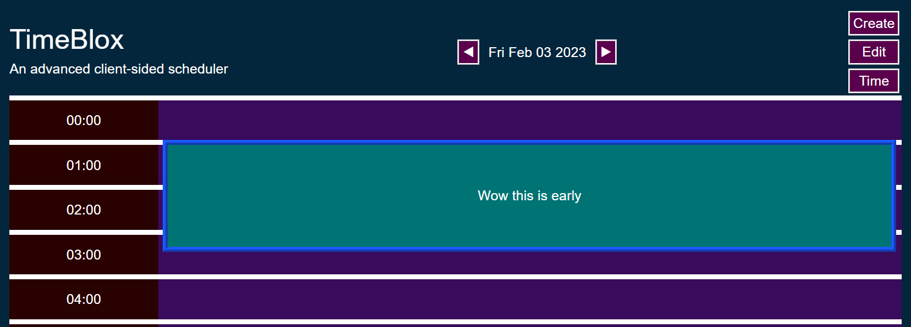

# Time Blox
An advanced scheduler (once fully built, it has more capabilities than Google Calendar or Outlook) 

In its current state, it is only able to save events for the current day, and they will need to be deleted from localStorage manually. Multiple events can flexibly overlap, and the start/end time can be precise to the minute.

Looks pretty good on all displays. Data / error handling is complete. It's got bones but little meat.

Dayjs was not used on this project. Mostly because I didn't want to set it up in TypeScript, but also because I can get everything done with the standard Date() in JavaScript (the requirements say: "feel free to use a different JavaScript solution to handle this functionality")

[Website link](https://lord-xld3.github.io/im-bad-at-naming-things/)

## Example

## Usage
Use the 'Create' button in the top-right to create events. Red colored text indicates required fields.

## Flow

## TODO
-Change current day (selecting from a calendar would be better)

-Set notification timers using event start time

-Handle display of repeating events

-Clear "cells" and "rows" in the EDIT button

-Display "tags" as a graph in the TIME button