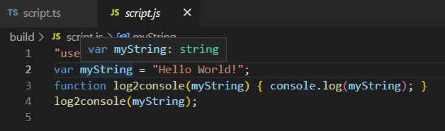

# Time Blox
We're going to make a 'schedule' in hour blocks for each day. Although not required, this program is pretty useless if we can't plan more than a day in advance, or view past events. Additionally, being able to set start and end times for each event, notifications once events start, and reocurring events make this program MUCH more useful.

## Sequence

INIT or when current day is changed

First: Get the current day

Second: Read local data to generate time blocks for current day
>Let's define our data:

>`var blockTuple:[blockStart: number, blockEnd: number, blockFreq:[], blockText: string]` // Fixed-length, strict-typed array AKA tuple

>`var blockData:[blockTuple]` // Array of tuples

Third: Conditionally set classes on blocks by comparing them to current hour.

Finally: Set a timer to notify user when next event starts

## Get current day

Display something like "January 12th, 2023" at top of website

## Utilizing TypeScript for superpowers

The more we specify how our data should behave, the better TypeScript can save us from mistakes later. 
>Defining our data as a tuple gives us some powers:
>>1. A string cannot be assigned to a number and vice versa.
>>2. The array is a fixed-length, assigning beyond the length of the array will give us an error.