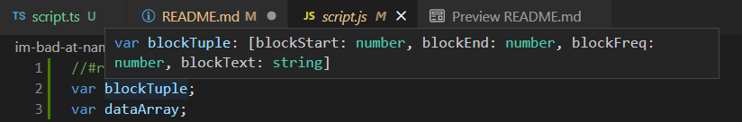

# Time Blox
We're going to make a 'schedule' in hour blocks for each day. Although not required, this program is pretty useless if we can't plan more than a day in advance, or view past events. Additionally, being able to set start and end times for each event, notifications once events start, and reocurring events make this program MUCH more useful.

## Sequence

INIT or when current day is changed

First: Get the current day

Second: Read local data to generate time blocks for current day
>Let's define our data:

>`var blockTuple:[blockStart: number, blockEnd: number, blockFreq:[], blockText: string]`

>`var blockData:[blockTuple]`

Third: Conditionally set classes on blocks by comparing them to current hour.

Finally: Set a timer to notify user when next event starts

## Get current day

Display something like "January 12th, 2023" at top of website

## Setup TypeScript
Install node.js first to use NPM, use Powershell for following commands:

>`npm install -g typescript`
>>^^^Required to compile to JavaScript

>`(Admin Powershell) Set-ExecutionPolicy -ExecutionPolicy RemoteSigned -Scope LocalMachine`
>>^^^Workaround for newer NPM versions (see https://github.com/npm/cli/issues/470)

Now we can write our app in TypeScript and compile to JavaScript!

## Import Dependencies for TypeScript

>`npm install --save @types/jquery`
>>^^^Required to use jquery in TypeScript

>Where's dayjs? Well, its not easy to import into TypeScript without an @types library or converting .js into a module. Since we only need a handful of functions from dayjs, we'll just create the ones we need using TypeScript.

## Utilizing TypeScript for superpowers

The more we specify how our data should behave, the better TypeScript can save us from mistakes later. 
>Defining our data as a tuple gives us some powers:
>>1. A string cannot be assigned to a number and vice versa.
>>2. The array is a fixed-length, assigning beyond the length of the array will give us an error.

## Complile .ts to .js:

>(inside the directory that contains the .ts file)
>>`tsc --strict true --target ES6 --watch true index.ts`
>>>This recompiles everytime index.ts is saved