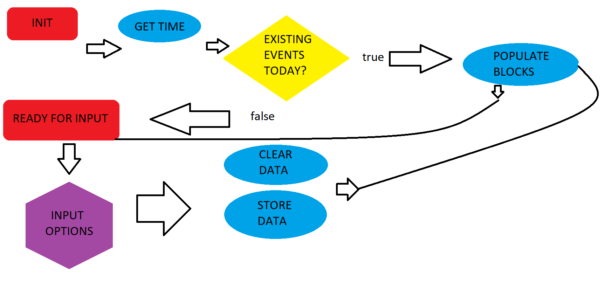

# Time Blox
We're going to make a 'schedule' for events each day. Although not required, this program is pretty useless if we can't plan more than a day in advance, or view past events. Additionally, being able to set start and end times for each event, event durations + custom tags (to compute total time per day) notifications once events start, and recurring events make this program MUCH more useful.

## Flow


## Global immutables

`const containerElement = $("#eventContainer")`

## Data objects - saved to local storage

// Main data, tied to a date

```
----Events are ALWAYS tied to the date they are created----
dateKey(DD-MM-YYYY){

----List of events for this date---- 
    eventArray: [

----Each eventIndex in eventArray contains...----
        (eventIndex){ 
            eventStart: (unix milliseconds)
            eventEnd: (unix millliseconds)
            eventDuration: (eventEnd - eventStart)
            eventText: (string)
            eventRecur: {
                byWeekOfMonth:[0,1,2,3]
                    byWeekday:[Monday, Tuesday,...]
                byNumberOfDays:[2,7,12,...]
                byDateOfMonth:[2,7,12,...]
            }
            eventTags: ["Work","Sleep","School",...] (optional custom tags)
        }
    ]
}
```

// Keep track of specific events that are recurring

```
recurEvents{
    recurArray:[
        dateKey{eventArray:[0,2,...]} // Array of events that recur that were created on that date
    ]
}
```

## Global mutables

`var dateObject = new Date()`

// Date can be incremented with 

`dateObject.setDate(1+(dateObject.getDate()))`

// Then, update date/time

    var currentDate = dateObject.toDateString()
    var currentWeekday = new Intl.DateTimeFormat("en-US", options).format(dateObject)
    var currentTime = dateObject.getTime()

## Interactables

`<=Prev` & `Next=>` - change current date

`Create` - opens pop-up with the following options:

    Time inputs:
        Start - define hour/minute event starts
        End - define hour/minute event ends

    String inputs:
        Name - define event name
        Tags - define custom tags separated by commas

    Recurrence options
        Checkbox inputs:
            Weekdays: 
                ✅ Monday
                ✅ Tuesday
                ...
            Week number:
                ✅ First
                ✅ Second
                ...
        Number inputs:
            Every x,y,... days:
                🔳(2,5,...)
            Every x,y,... day of month:
                🔳(12,21,31,...)


`Data` - shows raw data from local storage, useful for locating recurring events, has `Clear` button to clear selected cell(s)

`Time` - shows total time per custom tag, has `Range` to select days to include


## Basic functions
```
function initPage(){
    // Get current date/time
    // Create empty hour blocks starting on currentHour - 1
    
    if (recurEvents) { // Not empty
        call checkRecur()
    }
    
    if (currentDate in localStorage){
        call checkToday()
    }
    return // Do nothing if no events can be displayed
}
```

```
function eventTimer(){
    // Check if an event is coming up
    // Set timer until next event, alert on event start
    // After alert, clearInterval() and call eventTimer()
}
```

```
function saveEvent(){
    // push input data to eventArray[] on current dateKey{}
}
```

```
function checkRecur(){
    for (i=0; i < recurEvents.recurArray.length; i++){ // Iterate thru each dateKey{} in recurArray
        for (j=0; j < recurArray[i].keys(); j++){ // Iterate thru each eventArray[] in dateKey{}
            for (k=0; k < recurArray[i][j].length; k++){ // Iterate thru each (eventIndex in (eventArray[] in (dateKey{})))
                 
                // Check each recurrence option
                
                for (l=0; l < recurArray[i][j][k].eventRecur.byWeekOfMonth.length; l++){
                    // if (currentDate in byWeekday[] && currentDate in byWeekOfMonth[l])
                        // call loadEvent()
                }

                for (l=0; l < recurArray[i][j][k].eventRecur.byNumberOfDays.length; l++){
                    // if (daySince % byNumberOfDays[l] == 0)
                        // call loadEvent()
                }

                for (l=0; l < recurArray[i][j][k].eventRecur.byDateOfMonth.length; l++){
                    // if (currentDate == byDateOfMonth[l])
                        // call loadEvent()
                }
            }
        }
    }
}
```

```
function checkToday(){
    // Retrieve dateKey{} from localStorage
    for (i=0; i < dateKey.eventArray.length; i++){
        // call loadEvent()
    }
}
```

```
function loadEvent(){
    
    // determine where to insert event on page vertically (time-wise)
        // by comparing eventStart to list of elements on page
    
    // each "hour" should be 6.0 units high, 60.0 units wide
        
        // determine the "minute of the hour" event starts
            if ((60 - minute)==0) {
                top margin = 0
            }
            else {
                top margin = (60 - eventStartInMinutes) / 10
            }
        
        // get "event duration" in minutes
            // height = (eventDurationInMinutes * 0.1)
    
    // create element and insert into "hour" block
        // extend height down thru other "hour" blocks, on another Z-Index
        // check for vertically overlapping events (overlapping times)
            // events with the same start time will be inserted side-by-side by order they are created (from eventArray)
            // otherwise, event with earliest start time will be left-most event
            // flex left/right margins to fit all events with overlapping times
}
```

```
function selectData { // Used to view/delete existing data
    
    // retrieve all data from localStorage
    
    // Table 1: Recurring events
        // Rows - dateKeys
            // Columns - events per dateKey
    
    // Table 2: dateKeys
        // Rows - dateKeys
            // Columns - events per dateKey

    // Row headers - select all cells in row when clicked
        // Column headers - select all cells in column when clicked
            // Cell - select cell
    
    Button "clear" - clear selected cells
        // remove dateKey/cell in localStorage
    Button "edit" - greyed out with multiple selected cells, otherwise:
        // pop-up "save" / "cancel" buttons
        // directly edit text in cell
        // on "save" - replace dateKey/cell in localStorage (dateKey must be unique or unchanged)
            // reload / call selectData()
}
```

Woosh! That looks like a challenge, let's do it.